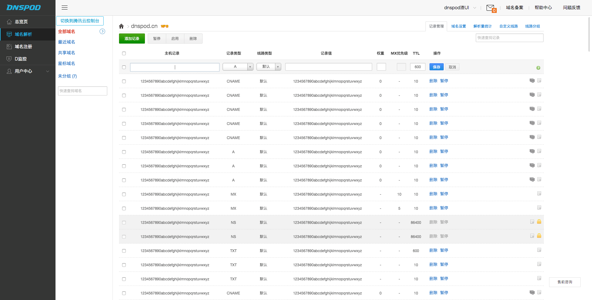

# mydnspod

[油猴插件地址/安装方式](https://greasyfork.org/zh-CN/scripts/387189-zeusro-%E5%AE%BD%E7%89%88-dnspod-cn)

让 dnspod 适配 1080p 屏幕

## 效果

## TODO

1. 适配其他尺寸屏幕(不大可能去实现(逃~))
2. 去掉定时器(请告诉我怎么监听iframe变化)

## 吐槽

域名配置页用了iframe加载来实现局部更新,而且过了一段时间之后iframe会消失,导致开发难度加大;页面布局一会用css,一会用内联CSS,我也是很郁闷.